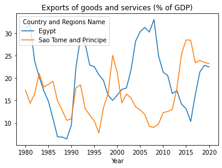

# Gspread Notebook

Projek ini dikembangkan sebagai salah satu capstone project dari Algoritma Academy Data Analytics Specialization. Deliverables yang diharapkan dari projek ini adalah melakukan analisis data dengan menggunakan library `gspread` untuk mendapatkan informasi dan dikemas dengan rapih dalam notebook. Terdapat 5 task yang perlu dikerjakan dan diakhiri dengan uploading file hasil analisa.

## Dependencies

- gspread
- oauthlib
- pandas

Atau Bapak/Ibu cukup menginstall requirements.txt dengan cara berikut

```python
pip install -r requirements.txt
```

## Rubrik

Maksimal skor yang akan didapatkan yakni 16 points:  

- **Setup (3 points)**
    - [ ] **Prepare virtual environment**
      - Please provide `requirements.txt` on the project folder.
    - [ ] **Create Telegram bot API via BotFather**
      - Please provide your bot link when making a submission.
    - [ ] **Using `os.environ` to secure token**
      - Important: Make sure you do not push `.env` to your GitHub Repository.

- **Chatbot functionalities**
    - **Basic function (3 points)**
        - [ ] **Command `/start` or `/help`**: correctly respond to user trigger
        - [ ] **Command `/about`**: provide developer information
        - [ ] **Function `echo_all()`**: using `emoji`
    - **Summary text report: `/summary` (3 points)**
        - [ ] Perform necessary **data wrangling** steps to extract information
        - [ ] Perform the right **mathematical calculation**
        - [ ] Send **summary message** using `Template`
    - **Visualization report: `/plot` (4 points)**
        - [ ] Perform necessary **data wrangling** steps to extract information
        - [ ] Perform the right **mathematical calculation**
        - [ ] **Send plot** with caption
        - [ ] **Tidy** plot layout (title, label, color, size)
- **Application deployment (3 points)**
    - [ ] Using **`Flask`** to serve the chatbot as an application
    - [ ] **Deploy** to Heroku using GitHub or Heroku CLI
    - [ ] Deployed chatbot run smoothly **without error**

## Project File Structure

```
gspred
├── 📁 assets
├── 📁 data_input
├── </> app.py
├── 📝 Notebook Guide.ipynb
└── 📝 requirements.txt
```

- Folders (**DO NOT CHANGE**):
    - `assets`: Images used in notebook
    - `data_input`: Dataset untuk analisis

- Application-related Files (**TO BE COMPLETED BY STUDENT**):
    - `app.py`: gspread untuk dijalankan secara lokal
    - `Notebook Guide.ipynb`: Panduan utama untuk alur kerja proyek

- Deployment-related Files (**DO NOT CHANGE**):
    - `.gitignore`: List of file extensions to be ignored when `git push` from local
    - `requirements.txt`: Daftar dependensi paket yang akan diinstall

## Expected Output

### Plot Analisis

Create a bot that can provide report on Facebook daily ads for different marketing campaign. Here is an example: https://t.me/algo_capstone_telebot

<p align="center" width="100%">
     
</p>

Here are the chatbot functionalities:

1. Command `/start` or `/help`: send welcome message containing list of available commands.

<p align="center" width="100%">
     
</p>

2. Command `/about`: send information about the bot developer.

<p align="center" width="100%">
     
</p>

3. Command `/summary`: generate text report for selected campaign ID.

<p align="center" width="100%">
    
</p>

Reply from bot after campaign ID is selected:

<p align="center" width="100%">
    
</p>

4. Command `/plot`: generate visualization and voice message report per age group for selected campaign ID.

<p align="center" width="100%">
    
</p>

Reply from bot after campaign ID is selected:

<p align="center" width="100%">
    
</p>

**Voice message:** 
<a href="https://drive.google.com/file/d/16hVORo-heUOjWje_g62aV6380-toBwWp/view?usp=sharing" target="_blank">Sample audio for Campaign ID 916</a>

> This is your requested plot for Campaign ID 916.
> Age group with the highest total spent is 30-34, while the lowest is 40-44. 
> Age group with the highest total approved conversion is 30-34, while the lowest is 45-49.
> Age group with the highest average CPC is 45-49, while the lowest is 40-44.

5. Default message: handle messages other than the previous commands.

<p align="center" width="100%">
    
</p>

### Deployed Application

<p align="center" width="100%">
     
</p>

This bot is expected to run **continuously** on a server. Therefore we create a `Flask` application which deployed to Heroku. Here is an example: https://algo-capstone-telebot.herokuapp.com/.
